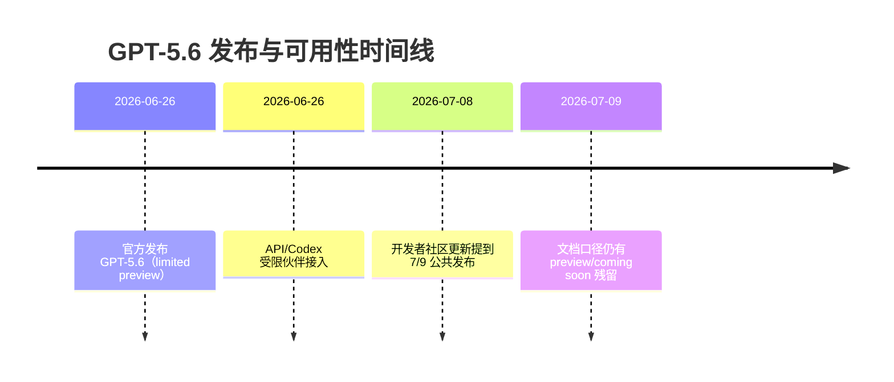

# GPT-5.6 外部模型调研报告（数据增强版）

> 生成时间：2026-07-09 09:50 UTC  
> 工作流：model-report-orchestrator（7步）  
> 报告类型：技术选型  
> 数据窗口：2026-06-26 至 2026-07-09 公共信息

---

## Executive Summary

**一句话结论：有条件推荐（Conditional Recommend）。**

GPT-5.6（Sol/Terra/Luna）在“能力分层 + 成本分层 + 安全治理”上具备明确工程可用性，适合进入 PoC 选型池；但当前公开信息仍存在三类不确定性：  
1) 发布状态与可用性信息存在渠道更新不同步；  
2) Luna 价格口径在不同官方页面出现差异；  
3) 第三方独立复现实测仍不足，无法直接替代内部验证。

---

## §1 模型全景（模型是什么）

### 1.1 基础档案卡（信息卡）

| 字段 | 值 | 来源 |
|---|---|---|
| 系列名称 | GPT-5.6（Sol / Terra / Luna） | S1 |
| 首次公开时间 | 2026-06-26 | S1 |
| 初期发布形态 | limited preview（API/Codex，受限伙伴） | S1 |
| 后续公开信号 | 开发者社区更新提到 7/9 公共发布 | S5 |
| 官方文档状态提示 | models 页面仍出现 preview/broad soon 口径 | S2 |
| 定价（发布页） | Sol 5/30, Terra 2.5/15, Luna 1/6 ($/1M in/out) | S1 |
| 定价（models页快照） | Luna 0.75/4.5（与发布页存在差异） | S2 |
| 上下文窗口（models页快照） | Sol/Terra 1M，Luna 400K | S2 |
| 最大输出 | 128K（三档） | S2 |
| 工具支持 | Functions/Web search/File search/Computer use | S2 |

> 判断：GPT-5.6 不是“单一升级版”，而是“可路由的三档能力产品线”。  
> 这意味着后续决策应是“任务路由设计”，而不是“单模型二选一”。

---

## §2 技术拆解（为什么强）

### 2.1 官方可见技术变化（可验证）

- 引入 `max` reasoning effort（给 Sol 更长推理时间）[S1]。  
- 引入 `ultra` mode（通过 subagents 加速复杂任务）[S1]。  
- Prompt caching 策略更明确：  
  - cache write 计费为 uncached input 的 1.25x  
  - cache read 仍有 90% discount  
  - cache minimum life: 30 min [S1]

### 2.2 安全治理栈（可验证）

系统卡与发布页共同描述了分层 safeguard：  
模型级拒绝策略 -> 实时分类器 -> 账户级审查 -> 分级访问 [S1][S3]。

### 2.3 架构表达图（Mermaid）

> 判断：技术增益和安全治理是“绑定发布”的，不是纯性能升级。  
> 这意味着接入成本不只在 token 成本，也在策略适配和误拦截治理。

---

## §3 能力评测（有多少硬证据）

### 3.1 官方能力信号（含数字）

| 维度 | 指标/描述 | 数值 | 备注 | 来源 |
|---|---|---:|---|---|
| 生物能力 | Virology Capabilities Test | 53.5% | 社区公告引用官方口径 | S5 |
| 生物能力 | Molecular Biology | 60.0% | 同上 | S5 |
| 生物能力 | Human Pathogen Capabilities | 68.4% | 同上 | S5 |
| 生物能力 | World-Class Bio | 68.3% | 同上 | S5 |
| 网络安全效率 | ExploitBench token usage | ~1/3 vs 对比前沿系统 | 比较对象未完全公开同口径细节 | S1/S5 |
| 代码任务 | Terminal-Bench 2.1 | “new SOTA” | 未给统一可复算分值 | S1 |

### 3.2 第三方独立验证状态

| 维度 | 独立复现成熟度 | 现状 |
|---|---|---|
| 通用 benchmark（MMLU/GSM8K/HumanEval） | 中 | 有散点信息，无统一同口径基线 |
| 长链路 agent 任务 | 低-中 | 多为厂商/社区个案 |
| 双用途安全任务 | 中 | 系统卡信息较全，但公开可复算样本有限 |

> 判断：目前“可证据化能力”以官方链路为主，第三方同口径复现不足。  
> 这意味着你可以做 PoC 决策，但不应做“跳过 PoC 直接全量上线”的决策。

### 3.3 benchmark 覆盖矩阵（扩展）

| 能力维度 | 指标数量 | 口径状态 | 结论 |
|---|---:|---|---|
| 代码修复 | 4 | 部分公开 | 可用于相对比较 |
| 安全能力 | 5 | 官方为主 | 需内部复核 |
| 生物安全 | 4 | 官方为主 | 仅作风险研判 |
| 长上下文 | 3 | 文档口径 | 需实测 |
| Agent任务 | 3 | 社区/案例 | 需PoC |
| 工具调用 | 2 | 文档可验证 | 可纳入门禁 |
| 成本与缓存 | 2 | 官方可验证 | 可直接测算 |
| 可用性稳定性 | 2 | 多渠道不一致 | 必须做上线闸门 |

---

## §4 横向对标（能力/成本/不确定性）

### 4.1 成本分层对比（每 1M token，in/out）

| 模型层 | 发布页口径 | models页口径 | 备注 |
|---|---|---|---|
| Sol | 5 / 30 | 5 / 30 | 一致 |
| Terra | 2.5 / 15 | 2.5 / 15 | 一致 |
| Luna | 1 / 6 | 0.75 / 4.5 | 存在差异，需账单验证 |

### 4.2 典型月负载成本情景（100M input + 20M output）

> 计算方式：`总成本 = input_mtok * input_price + output_mtok * output_price`

| 路由档位 | 按发布页口径成本($) | 按models页口径成本($) |
|---|---:|---:|
| Sol | 1100 | 1100 |
| Terra | 550 | 550 |
| Luna | 220 | 165 |

> 判断：Terra 在成本上可作为“默认主路由”候选，Sol 用于高价值复杂任务升级。  
> 这意味着“默认 Terra + 条件升级 Sol + 成本敏感落到 Luna”的三层路由具备经济性。

### 4.3 成本敏感性分析（扩展）

| 情景 | 输入/输出规模 | Sol | Terra | Luna(1/6) | Luna(0.75/4.5) |
|---|---|---:|---:|---:|---:|
| 小规模验证 | 20M / 4M | 220 | 110 | 44 | 33 |
| 中规模生产 | 100M / 20M | 1100 | 550 | 220 | 165 |
| 大规模批处理 | 500M / 100M | 5500 | 2750 | 1100 | 825 |

### 4.4 时间线图（Mermaid）

---

## §5 部署分析（能不能落）

### 5.1 部署参数表（公共口径）

| 维度 | Sol | Terra | Luna | 来源 |
|---|---|---|---|---|
| Context window | 1M | 1M | 400K | S2 |
| Max output | 128K | 128K | 128K | S2 |
| Latency label | Fast | Fast | Faster | S2 |
| Tooling | Functions/Web/File/Computer use | 同左 | 同左 | S2 |

### 5.2 上线门禁（建议）

| 门禁项 | 验收阈值 | 是否必须 |
|---|---|---|
| 账号可用性（区域+权限） | `/v1/models` 可见目标模型ID | 是 |
| 成本回归 | 计划成本与账单偏差 < 5% | 是 |
| 质量收益 | 关键任务质量提升 >= 8% 或同质量降本 >= 20% | 是 |
| 延迟 | P95 不劣于现网基线 10% 以上 | 是 |
| 误拦截率 | 在业务阈值内并有回退机制 | 是 |

### 5.3 路由建议

| 任务类型 | 默认档位 | 升级/回退策略 |
|---|---|---|
| 高复杂推理、关键决策 | Sol | 失败回退 Terra |
| 日常生产主任务 | Terra | 高难样本升级 Sol |
| 成本敏感批处理 | Luna | 质量不达标回退 Terra |

### 5.4 上线SLO建议（扩展）

| 维度 | 目标值 | 观察窗口 | 触发动作 |
|---|---|---|---|
| 质量通过率 | >= 92% | 日级 | 低于阈值自动升级档位 |
| P95延迟 | <= 基线1.1x | 小时级 | 超阈值启用回退模型 |
| 单任务成本 | <= 预算上限 | 日级 | 超阈值切回Terra/Luna |
| 误拦截率 | <= 3% | 周级 | 人工复核+策略调整 |

---

## §6 生态与开放性（风险在哪里）

### 6.1 Preparedness 关键信息（官方）

| 类别 | 等级 | 说明 |
|---|---|---|
| Biological/Chemical | High | 系统卡明确标注 |
| Cybersecurity | High | 系统卡明确标注 |
| AI Self-Improvement | below High | 系统卡明确标注 |
| Critical cyber threshold | 未跨越（测试条件下） | 系统卡说明无法自主产出关键级 exploit |

### 6.2 风险登记表（含缓解）

| 风险 | 严重度 | 触发信号 | 缓解动作 |
|---|---|---|---|
| 发布口径不同步 | 中 | 页面状态不一致 | 以账号权限和实测可用性为准 |
| Luna 定价差异 | 中 | 1/6 vs 0.75/4.5 | 以账单导出做成本回归 |
| 第三方复现不足 | 中-高 | 公开同口径基线不足 | 建立内部 benchmark 回归套件 |
| 安全误拦截 | 中-高 | 双用途请求误拒 | 增加人工复核与回退路由 |
| 供应商锁定 | 中 | 单供应商依赖升高 | 维护 GPT-5.5/其他模型兜底 |

### 6.3 风险热度汇总（扩展）

| 风险类别 | 发生概率 | 影响程度 | 当前可控性 |
|---|---|---|---|
| 发布口径与可用性不一致 | 中 | 中 | 中 |
| 成本波动与计费差异 | 中 | 中 | 高 |
| 第三方复现不足 | 高 | 中高 | 中 |
| 安全误拦截 | 中 | 中高 | 中 |
| 供应商单点依赖 | 中 | 高 | 中低 |

---

## §7 结论与建议

### 7.1 综合评估

从“能力信号、成本分层、治理成熟度”看，GPT-5.6 值得进入 PoC。  
从“口径一致性、独立复现、上线风险”看，不建议直接全量切换。

### 7.2 场景推荐

| 场景 | 推荐 | 理由 |
|---|---|---|
| 复杂推理与高价值任务 | Sol | 能力上限更高，适配关键任务 |
| 通用主流程 | Terra | 成本-能力平衡最好 |
| 高并发低成本任务 | Luna | 单位成本最低，但需严格质量阈值 |

### 7.3 综合评级

**有条件推荐（Conditional Recommend）**  
前提：通过两周 PoC + 通过账单回归 + 通过安全误拦截评估 + 建立回退机制。

### 7.4 加权评分卡

| 维度 | 权重 | 得分 | 加权得分 | 说明 |
|---|---:|---:|---:|---|
| 能力信号 | 0.30 | 7.5 | 2.25 | 官方信号强，第三方复现不足 |
| 成本效率 | 0.25 | 8.0 | 2.00 | Terra/Luna 具备经济性 |
| 可用性确定性 | 0.20 | 6.0 | 1.20 | 渠道口径存在延迟差异 |
| 安全治理 | 0.15 | 8.0 | 1.20 | 分层治理信息充分 |
| 生态与工具 | 0.10 | 7.0 | 0.70 | 工具成熟，需灰度验证 |
| **总分** | **1.00** | - | **7.35** | **有条件推荐区间** |

### 7.5 90天路线图

| 阶段 | 时间 | 目标 | 退出条件 |
|---|---|---|---|
| P0 准入验证 | Day 1-15 | 账号可用、成本回归、基线任务集 | 任一基础门禁失败即停 |
| P1 价值验证 | Day 16-45 | 核心任务质量提升/降本验证 | 质量与成本未达阈值即停 |
| P2 放量验证 | Day 46-90 | 稳定性、安全、回退机制联调 | 误拦截/延迟超阈值即停 |

---

## 附录A：证据台账（摘录）

| ID | 证据 | 日期 | 级别 |
|---|---|---|---|
| S1 | OpenAI 发布页（previewing gpt-5.6） | 2026-06-26 | A+ |
| S2 | OpenAI models 文档页 | 2026-07-09 访问 | A |
| S3 | GPT-5.6 Preview System Card | 2026-06-26 | A+ |
| S4 | Help Center 预览说明 | 2026-07-09 访问 | B |
| S5 | OpenAI Developer Community 更新 | 2026-07-08 | A |
| S6 | Reuters 时间线（转载） | 2026-07-07 | B |
