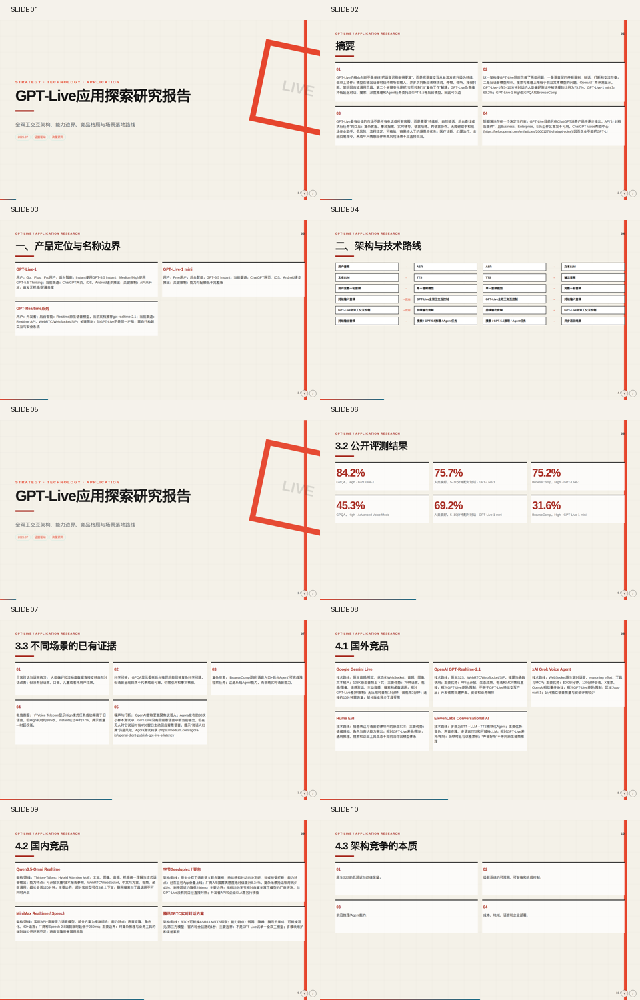

# GPT‑Live应用探索研究：交付入口

本目录提供同一份已通过质量门的报告与汇报材料。`HTML`和`PPTX`为下载文件；
`PNG`预览图可直接在GitHub页面中查看。

## 先看结果

## 交付文件

| 内容 | 文件 | 使用方式 |
|---|---|---|
| 研究报告终稿（Markdown） | [gpt-live-application-research-final.md](gpt-live-application-research-final.md) | GitHub可直接阅读 |
| HTML幻灯片 | [gpt-live-application-research-slides.html](gpt-live-application-research-slides.html?raw=1) | 下载后在浏览器本地打开；共20页，自包含 |
| 可编辑PPTX | [gpt-live-application-research-slides.pptx](gpt-live-application-research-slides.pptx?raw=1) | 下载后用PowerPoint/Keynote/WPS打开 |
| 幻灯片预览图 | [gpt-live-application-research-slides-preview.png](gpt-live-application-research-slides-preview.png) | GitHub可直接预览 |

## 查看限制

GitHub出于安全策略不会直接运行仓库里的HTML/JavaScript，因此HTML幻灯片在GitHub中会显示为
代码或下载文件，而非在线播放。该限制不能在不部署私有静态站点或不公开托管的前提下绕过。
预览图用于在仓库内直接查看版式；需要翻页和互动时下载HTML后本地打开。
