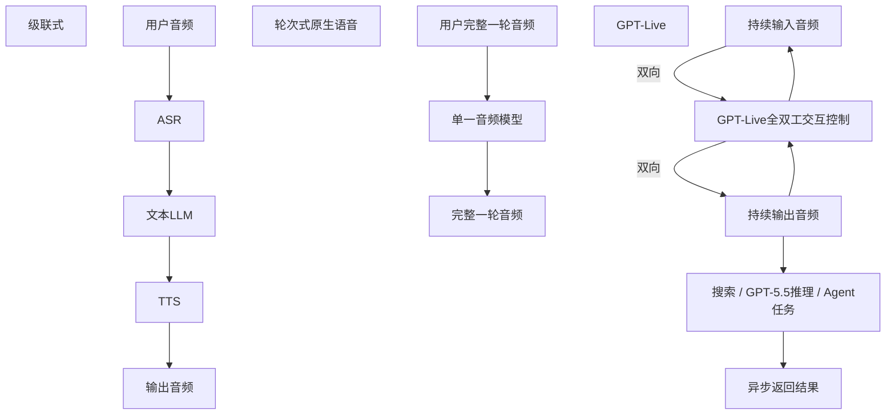

# GPT‑Live应用探索研究报告

> 研究日期：2026年7月13日  
> 研究方法：公开资料桌面研究；优先采用OpenAI、Google、阿里云、火山引擎、xAI等官方资料，并对厂商自评与第三方测试分别标注。  
> 名称边界：本文的“GPT‑Live”专指OpenAI于2026年7月8日发布、用于ChatGPT Voice的`GPT‑Live‑1`与`GPT‑Live‑1 mini`。它与已经开放给开发者的`GPT‑Realtime`系列共享实时语音方向，但不是同一个可直接调用的API产品。截至研究日，GPT‑Live API仍未开放。

## 摘要

GPT‑Live的核心创新不是单纯“把语音识别做得更准”，而是把语音交互从轮流发言升级为持续、全双工协作：模型在输出语音时仍持续听取输入，并多次判断应该继续说、停顿、倾听、接受打断、简短回应或调用工具。第二个关键变化是把“交互控制”与“复杂工作”解耦：GPT‑Live负责维持低延迟对话，搜索、深度推理和Agent任务委托给GPT‑5.5等后台模型，因此可以边维持交流，边等待复杂任务完成。[OpenAI官方发布](https://openai.com/index/introducing-gpt-live/)

这一架构使GPT‑Live同时改善了两类问题：一是语音层的停顿误判、抢话、打断和交流节奏；二是旧语音模型知识、搜索与推理上限低于前沿文本模型的问题。OpenAI厂商评测显示，GPT‑Live‑1在5–10分钟对话的人类偏好测试中被选择的比例为75.7%，GPT‑Live‑1 mini为69.2%；GPT‑Live‑1 High在GPQA和BrowseComp上分别达到84.2%和75.2%。但后两项提升主要来自GPT‑5.5委托，不能全部归因于语音模型本体；τ³‑Voice Telecom是内部变体，尚缺独立复现。[OpenAI官方只给出方向性说明](https://openai.com/index/introducing-gpt-live/)，具体图表数值由发布页面图表的媒体转录交叉核对，[The Decoder转录](https://the-decoder.com/chatgpt-can-now-listen-and-talk-at-the-same-time-making-ai-conversations-seem-more-human/)。

GPT‑Live最有价值的市场不是所有电话或所有客服，而是需要“持续听、自然插话、后台查找或执行任务”的交互：复杂客服、事故报案、实时辅导、语言陪练、跨语言协作、无障碍助手和现场作业助手。低风险、流程稳定、可核验、容易转人工的场景应优先；医疗诊断、心理治疗、金融交易指令、未成年人情感陪伴等高风险场景不应直接自治。

短期落地存在一个决定性约束：GPT‑Live目前只在ChatGPT消费产品中逐步推出，API“计划稍后提供”，且Business、Enterprise、Edu工作区首发不可用。[ChatGPT Voice帮助中心](https://help.openai.com/en/articles/20001274-chatgpt-voice) 因而企业不能把GPT‑Live当前消费端体验直接当作可采购的生产API。可行路径是先用已GA的OpenAI Realtime API、Gemini Live、Qwen‑Omni Realtime或豆包实时语音完成场景验证，并为未来GPT‑Live API保留可替换的模型适配层。

## 一、产品定位与名称边界

### 1.1 产品定位

GPT‑Live是ChatGPT Voice的新一代“持续交互层”，产品目标是让人与AI的交流更接近电话或面对面协作，而不是“用户说完一句—系统处理—系统说完一句”的语音聊天。OpenAI披露，每周有超过1.5亿人使用ChatGPT Voice和Dictation，使用场景包括免手操作、语言练习、睡前故事和通勤聊天，这构成GPT‑Live首发的消费端流量基础。[OpenAI官方发布](https://openai.com/index/introducing-gpt-live/)

首发产品分层如下：

| 产品 | 用户 | 后台智能 | 当前渠道 | 关键限制 |
|---|---|---|---|---|
| GPT‑Live‑1 | Go、Plus、Pro用户 | Instant使用GPT‑5.5 Instant；Medium/High使用GPT‑5.5 Thinking | ChatGPT网页、iOS、Android逐步推出 | API未开放；首发无视频/屏幕共享 |
| GPT‑Live‑1 mini | Free用户 | GPT‑5.5 Instant | ChatGPT网页、iOS、Android逐步推出 | 能力与配额低于完整版 |
| GPT‑Realtime系列 | 开发者 | Realtime原生语音模型，当前文档推荐`gpt-realtime-2.1` | Realtime API，WebRTC/WebSocket/SIP | 与GPT‑Live不是同一产品；需自行构建交互与安全系统 |

> **表格说明：** 本表以“产品、用户、后台智能、当前渠道、关键限制”为字段，共整理3条记录。指标定义以表头、单位和同一统计口径为准；核心结论应依据同列横向比较、同行关联及表内来源推导，不得脱离原表外推。

来源：[GPT‑Live发布说明](https://openai.com/index/introducing-gpt-live/)、[ChatGPT Voice帮助中心](https://help.openai.com/en/articles/20001274-chatgpt-voice)、[OpenAI Realtime开发文档](https://developers.openai.com/api/docs/guides/realtime)。

### 1.2 GPT‑Live不是什么

1. **不是传统ASR→LLM→TTS管线。** 传统级联方式易在转写和合成间丢失语气、停顿等信息，并叠加多段时延。
2. **不是只减少延迟的Advanced Voice Mode升级。** Advanced Voice Mode已经使用单一音频模型，但仍以离散轮次运行；GPT‑Live进一步改为持续全双工处理。
3. **不是GPT‑5.5的语音版。** GPT‑Live负责交互控制，复杂任务可委托GPT‑5.5；其能力是系统组合结果。
4. **不是当前可采购的企业API。** OpenAI仅表示计划开放API，未给出日期、价格、SLA或企业数据治理条款。[OpenAI官方发布](https://openai.com/index/introducing-gpt-live/)

## 二、架构与技术路线

### 2.1 三代语音AI路线

> **流程图说明：** 级联式把语音拆成ASR、文本推理和TTS；轮次式原生语音减少模块切换，
> 但仍等待一轮结束；GPT‑Live把持续听说与后台搜索/推理解耦，交互层和深度工作可并行。

### 2.2 连续全双工交互层

GPT‑Live持续处理输入并同步生成输出，不把“静音”简单等价为“用户说完了”。模型每秒多次判断：

- 是否继续听；
- 是否应该开始或继续发言；
- 用户的声音是有效打断、背景声还是短暂应答；
- 是否暂停、结束当前输出或给出“嗯”“明白”等backchannel；
- 是否调用工具或委托后台模型。

这让时间本身成为输入特征：停顿长度、重叠发言、节奏和背景声都会影响交互决策。[OpenAI官方架构说明](https://openai.com/index/introducing-gpt-live/) 但OpenAI没有公开参数量、音频tokenizer、训练数据、网络层结构、推理算力或端侧/云端切分，外界不能据现有资料断言其采用何种Transformer变体或具体编码器。

### 2.3 交互与深度工作的解耦

GPT‑Live将低延迟社交交互与高成本推理解耦。简单请求由交互层直接处理；需要搜索、科学推理或多步Agent工作时，委托GPT‑5.5等后台模型。交互层可在等待期间继续与用户交流，避免工具调用时长时间沉默。

这一设计的优势是：

- 后台前沿模型可独立升级，交互层不必随每个智能版本重训；
- Instant/Medium/High形成时延—质量档位；
- 可以并行处理对话管理和复杂任务。

代价是：

- 系统行为由多个模型与工具共同决定，故障归因更难；
- 委托时的上下文摘要可能丢失语气或细节；
- 后台任务完成顺序可能与对话进程冲突；
- 成本、尾延迟和安全策略由最慢、最复杂的委托链决定。

### 2.4 与开发者Realtime API的关系

OpenAI Realtime API已经提供原生Speech-to-Speech、WebRTC、WebSocket、SIP、图像输入、函数调用和远程MCP；当前文档推荐`gpt-realtime-2.1`构建低延迟语音Agent。[Realtime与音频指南](https://developers.openai.com/api/docs/guides/realtime) GPT‑Live则在其上进一步强调“持续全双工交互+后台委托”，并首先作为ChatGPT体验发布。两者可共享工程经验，但不能假定GPT‑Live发布后会沿用相同事件协议、价格或上下文限制。

### 2.5 全双工技术路线并不唯一

公开研究显示，全双工系统至少存在三类实现：

1. **并行音频流生成。** [Moshi](https://arxiv.org/abs/2410.00037)分别建模用户与系统音频流，
   直接学习重叠说话、打断和插话，论文报告理论延迟160ms、实践约200ms。
2. **语义状态预测器。** [MinMo](https://arxiv.org/abs/2501.06282)在LLM隐藏状态上训练Full
   Duplex Predictor，判断继续回应、停止输出或转入倾听；论文报告实践全双工延迟约800ms。
3. **原生语音语义联合建模。** 字节跳动
   [Seeduplex](https://seed.bytedance.com/zh/blog/introducing-seed-full-duplex-speech-llm-attentive-listening-robust-interference-suppression-enabling-more-natural-interaction)
   持续感知音频并综合声学特征和对话上下文决定说、听或接受打断。

[2026年全双工系统综述](https://arxiv.org/abs/2606.19453)进一步指出，端到端语音生成不等于
全双工；评价必须覆盖重叠讲话、附和、静默、打断、恢复和说话人归属等交互行为。OpenAI尚未
披露GPT‑Live的参数量、tokenizer、训练数据和网络细节，因此本文只能确认其系统行为与“交互层
+后台委派”架构，不能判断它在上述底层路线中具体采用哪一种。

## 三、能力、边界与表现

### 3.1 能力矩阵

| 能力 | 当前表现判断 | 证据 | 边界 |
|---|---|---|---|
| 同听同说 | 核心优势 | 官方确认full-duplex，可边输出边监听 | 重叠讲话、网络抖动、扬声器回声仍影响识别 |
| 自然轮换与停顿 | 相对上一代明显改善 | 5–10分钟人评偏好显著领先 | 官方未公开绝对打断时延、误打断率 |
| 主动倾听/backchannel | 能输出简短应答或保持安静 | 官方演示与说明 | 过多“嗯、对”可能显得讨好或干扰 |
| 背景噪声处理 | 官方称更聚焦主讲人 | 官方发布 | 独立小样本测试发现可能误把背景语音当成对话对象 |
| 搜索与复杂推理 | 通过GPT‑5.5委托显著增强 | GPQA、BrowseComp厂商评测 | 不是语音本体单独能力；依赖网络、搜索与委托时延 |
| 工具/Agent任务 | 可在后台委托并保持交流 | 官方架构说明 | 消费端开放工具有限；GPT‑Live API未发布 |
| 实时翻译 | 连续处理支持边听边译 | 官方列为能力 | 语言覆盖和口音不均；未公开GPT‑Live专属翻译集分语言成绩 |
| 多模态 | 可结合文本、图片、文件、视觉卡片 | ChatGPT Voice说明 | 首发不支持视频和屏幕共享 |
| 长时会话 | 可利用ChatGPT记忆维持上下文 | 帮助中心 | 未公开音频上下文、压缩策略和长期漂移指标 |
| 情绪与安全 | 有语音专用训练、实时输入输出检测 | GPT‑Live系统卡 | 情感依赖、自伤、未成年人等仍是高风险区 |

> **表格说明：** 本表以“能力、当前表现判断、证据、边界”为字段，共整理10条记录。指标定义以表头、单位和同一统计口径为准；核心结论应依据同列横向比较、同行关联及表内来源推导，不得脱离原表外推。

### 3.2 公开评测结果

| 评测 | GPT‑Live‑1 | GPT‑Live‑1 mini | Advanced Voice Mode | 解读 |
|---|---:|---:|---:|---|
| 人类偏好，5–10分钟配对对话 | 75.7% | 69.2% | 对照组 | 衡量自然度、轮换、打断与整体流畅性；厂商人评 |
| 对话流畅度，7分制 | 4.96 | 4.33 | 3.80 | 有明显提升，但仍未接近满分 |
| 愉悦度，7分制 | 5.19 | 4.47 | 3.82 | 说明声音体验改善，不等于任务正确率 |
| GPQA，High | 84.2% | 未完整披露 | 45.3% | 主要体现GPT‑5.5 High委托后的科学推理 |
| BrowseComp，High | 75.2% | 31.6% | 0.7% | 主要体现搜索Agent委托能力 |
| τ³‑Voice Telecom内部变体 | High约65%；Instant约37% | 未披露 | 约30% | 多轮电信客服；内部用户模拟器与内部变体，独立性最低 |

> **表格说明：** 本表以“评测、GPT‑Live‑1、GPT‑Live‑1 mini、Advanced Voice Mode、解读”为字段，共整理6条记录。指标定义以表头、单位和同一统计口径为准；核心结论应依据同列横向比较、同行关联及表内来源推导，不得脱离原表外推。

说明：OpenAI正文对评测给出方向性结论，图表数字由官方页面图表的媒体转录交叉核对。[官方发布](https://openai.com/index/introducing-gpt-live/)、[The Decoder](https://the-decoder.com/chatgpt-can-now-listen-and-talk-at-the-same-time-making-ai-conversations-seem-more-human/)、[RuntimeWire](https://runtimewire.com/article/openai-gpt-live-chatgpt-voice)。所有结果均为OpenAI组织或发布的评测，尚不能替代中文、电话窄带、方言、弱网和真实业务数据上的独立A/B测试。

### 3.3 不同场景的已有证据

1. **日常对话与语言练习：** 人类偏好和流畅度数据直接支持自然对话改善；但没有分语言、口音、儿童或老年用户结果。
2. **科学问答：** GPQA显示委托后台推理后能回答复杂科学问题，但语音呈现自然不代表结论可靠，仍需引用和事实核验。
3. **复杂搜索：** BrowseComp证明“语音入口+后台Agent”可完成难检索任务；这是系统Agent能力，而非纯实时语音能力。
4. **电信客服：** τ³‑Voice Telecom显示High模式任务成功率高于旧语音，但High耗时约385秒，Instant成功率约37%，揭示质量—时延权衡。
5. **噪声与打断：** OpenAI宣称更能聚焦说话人；Agora发布的30次小样本测试中，GPT‑Live没有因背景语音中断当前输出，但在无人对它说话时有4/30窗口主动回应背景语音，提示“说话人归属”仍是风险。[Agora测试转录](https://medium.com/agora-io/openai-didnt-publish-gpt-live-s-latency-so-we-measured-it-cf73016db989) 该测试规模较小，只能作为风险信号。

## 四、竞品比较

### 4.1 国外竞品

| 产品 | 技术路线 | 主要优势 | 相对GPT‑Live差异/限制 |
|---|---|---|---|
| Google Gemini Live | 原生音频/视觉，状态化WebSocket，音频、图像、文本输入；128K原生音频上下文 | 70种语言、视频/图像、情感对话、主动音频、搜索和函数调用 | 无压缩时音频15分钟、音视频2分钟；连接约10分钟需恢复；部分版本异步工具受限 |
| OpenAI GPT‑Realtime‑2.1 | 原生S2S，WebRTC/WebSocket/SIP，推理与函数调用 | API已开放、生态成熟、电话和MCP集成直接 | 不等于GPT‑Live持续交互产品；开发者需自建界面、安全和业务编排 |
| xAI Grok Voice Agent | WebSocket原生实时语音，reasoning effort，工具与MCP | $0.05/分钟、120分钟会话、X搜索、OpenAI相似事件协议 | 区域为us-east-1；公开独立语音质量与安全评测较少 |
| Hume EVI | 情感表达与语音韵律导向的原生S2S | 情绪感知、角色与表达能力突出 | 通用推理、搜索和企业工具生态不如前沿综合模型体系 |
| ElevenLabs Conversational AI | 多数为STT→LLM→TTS模块化Agent | 音色、声音克隆、多语言TTS和可替换LLM | 级联时延与误差累积；“声音好听”不等同原生音频推理 |

> **表格说明：** 本表以“产品、技术路线、主要优势、相对GPT‑Live差异/限制”为字段，共整理5条记录。指标定义以表头、单位和同一统计口径为准；核心结论应依据同列横向比较、同行关联及表内来源推导，不得脱离原表外推。

Gemini数据来源：[Live API概览](https://ai.google.dev/gemini-api/docs/live-api)、[会话管理](https://ai.google.dev/gemini-api/docs/live-api/session-management)、[工具能力](https://ai.google.dev/gemini-api/docs/live-api/tools)。xAI数据来源：[Voice Agent API](https://docs.x.ai/developers/models/voice-agent-api)。

### 4.2 国内竞品

| 产品 | 架构/路线 | 能力特点 | 主要边界 |
|---|---|---|---|
| Qwen3.5‑Omni Realtime | Thinker‑Talker；Hybrid Attention MoE；文本、图像、音频、视频统一理解与流式语音输出 | 可开放权重/技术报告参照，WebRTC/WebSocket，中文与方言、视频、函数调用；最长会话120分钟 | 部分实时型号仅8轮上下文；联网搜索与工具调用不可同时开启 |
| 字节Seeduplex / 豆包 | 原生全双工语音语义联合建模；持续感知并动态决定听、说或接受打断 | 已在豆包App全量上线；厂商A/B披露满意度绝对值提升8.34%，复杂场景抢话相对减少40%，判停延迟约降低250ms | 指标均为字节相对自家半双工模型的厂商评测，与GPT‑Live没有同口径直接对照；开发者API和企业SLA需另行核验 |
| MiniMax Realtime / Speech | 实时API+高表现力语音模型，部分方案为模块组合 | 声音克隆、角色化、40+语言；厂商称Speech 2.8端到端时延低于250ms | 对复杂推理与业务工具的端到端公开评测不足；声音克隆带来冒用风险 |
| 腾讯TRTC实时对话方案 | RTC+可替换ASR/LLM/TTS级联 | 弱网、降噪、腾讯云集成、可替换混元/第三方模型；官方称全链路约1秒 | 不是GPT‑Live式单一全双工模型；多模块维护和误差累积 |

> **表格说明：** 本表以“产品、架构/路线、能力特点、主要边界”为字段，共整理4条记录。指标定义以表头、单位和同一统计口径为准；核心结论应依据同列横向比较、同行关联及表内来源推导，不得脱离原表外推。

来源：[Qwen3.5‑Omni技术报告](https://arxiv.org/abs/2604.15804)、[Qwen实时API限制](https://help.aliyun.com/zh/model-studio/realtime)、[字节Seeduplex官方发布](https://seed.bytedance.com/zh/blog/introducing-seed-full-duplex-speech-llm-attentive-listening-robust-interference-suppression-enabling-more-natural-interaction)、[火山实时对话方案](https://www.volcengine.com/docs/82379/1393085?lang=zh)、[MiniMax Realtime](https://www.minimax.io/news/realtime-api)、[腾讯TRTC方案](https://cloud.tencent.com/document/product/647/115412)。

### 4.3 架构竞争的本质

市场并非简单比较“谁最像真人”，而是在四种目标间取舍：

1. **原生S2S的低延迟与韵律保留；**
2. **级联系统的可观测、可替换和合规控制；**
3. **前沿推理/Agent能力；**
4. **成本、地域、语言和企业部署。**

GPT‑Live的差异化是“全双工交互控制+后台前沿模型委托”，Gemini偏向实时音视频多模态，Qwen偏向开放全模态架构与中文生态，豆包偏向中文语音体验和国内业务交付，MiniMax偏向音色和角色表现，传统级联方案则在可审计和组件可替换上仍有优势。高风险业务不应因原生S2S体验更自然就放弃级联转写、规则引擎和人工复核。

## 五、风险与局限

### 5.1 模型与系统风险

- **幻觉被自然声音放大。** 流畅、自信和情绪化的语音容易让用户高估答案真实性。
- **说话人归属与误触发。** 背景对话、电视、多人会话可能被当作对模型的指令。
- **打断竞争。** 太敏感会频繁停下，太迟钝会压制用户；网络往返和播放缓冲也是打断时延的一部分。
- **委托链不透明。** 用户难以判断当前答案来自GPT‑Live、GPT‑5.5、搜索还是工具，审计需额外记录。
- **上下文漂移。** 长会话中摘要、记忆与任务状态可能不一致，尤其是中断和并发工具返回时。
- **语言不均衡。** OpenAI承认部分语言有非母语口音或流利度缺口；中文方言和专业术语必须专项评测。
- **缺乏API与企业SLA。** 当前不能据消费端发布承诺生产接入、并发、价格、数据驻留和版本稳定性。

### 5.2 安全、隐私与社会风险

GPT‑Live系统卡显示其增加了实时输入输出检查，可引导、打断、提供支持资源或结束高风险通话；模型使用预设声音并限制模仿真人。[GPT‑Live系统卡](https://deploymentsafety.openai.com/gpt-live) 系统卡同时报告：生产对抗集中，GPT‑Live‑1情感依赖得分由旧模型0.88变为0.82，mini性内容由0.97变为0.95；官方说明两项差异均不具统计显著性，而且该测试集不按真实流量加权，不能解释为线上发生率。它们仍提示陪伴、心理支持和未成年人场景应持续监测，而不能据此断言GPT‑Live已出现显著安全退化。

OpenAI与MIT Media Lab此前对超过400万段对话、4000多名受访者和接近1000名参与者的28天
随机对照研究发现，情感互动在真实使用中总体少见，但极高使用量与更高的自报依赖指标相关；
语音模式对福祉的影响取决于使用时长和用户初始状态。
[研究原文](https://openai.com/index/affective-use-study/)并非GPT‑Live专项评测，但说明陪伴产品
不能只优化会话时长和留存，还应设置使用强度、依赖信号和现实社交替代指标。

生产部署必须处理：

- 明示AI身份、录音与数据用途；
- 最小化保存原始音频，区分转写、声纹和业务字段；
- 未成年人、医疗、心理、金融等场景的强制人工升级；
- 防止声音克隆、社工、越权工具调用和提示注入；
- 逐通话保存工具调用、关键决策、转人工原因和模型版本；
- 为错误答案、连接中断和安全拦截设计可理解的用户体验。

### 5.3 评测局限

目前GPT‑Live数据主要来自厂商评测：

- 人类偏好证明“更愿意聊”，不证明任务完成率、事实正确率或商业ROI；
- GPQA/BrowseComp主要测试委托后的后台智能；
- τ³‑Voice Telecom是内部变体和模拟用户，不等同真实客户；
- 未披露中文、方言、电话8kHz、弱网、多人、老年人、儿童和无障碍用户的分层结果；
- 未公开P50/P95首音时延、打断停止时延、误打断率、工具调用成功率和每分钟成本。

因此采购前必须使用企业自己的通话分布做回放测试和小流量A/B。

## 六、市场需求与应用场景

### 6.1 需求信号

- OpenAI称每周已有超过1.5亿用户使用Voice和Dictation，证明语音入口已具备大众使用基础。[OpenAI](https://openai.com/index/introducing-gpt-live/)
- Gartner对187名客服负责人的调查显示，85%计划在2025年探索或试点面向客户的对话式生成AI；其中44%在探索语音机器人、11%在试点、5%已部署。但61%存在知识库文章积压，说明主要瓶颈常在知识与流程，而不只在模型。[Gartner](https://www.gartner.com/en/newsroom/press-releases/2024-12-09-gartner-survey-reveals-85-percent-of-customer-service-leaders-will-explore-or-pilot-customer-facing-conversational-genai-in-2025)
- Gartner又指出，95%的客服领导者计划保留人工坐席，预计到2027年一半原计划大幅裁员的组织会放弃该计划，合理形态是“数字优先但非只有数字”。[Gartner](https://www.gartner.com/en/newsroom/press-releases/2025-06-10-gartner-predicts-50-percent-of-organizations-will-abandon-plans-to-reduce-customer-service-workforce-due-to-ai)
- Travelers的Realtime API事故报案助手在全美推广后，使用该助手的客户中85%–90%通过AI完成报案，说明边界清晰、数据结构明确、可转人工的高价值流程能够规模化。[OpenAI/Travelers案例](https://openai.com/index/travelers/)

### 6.2 场景优先级

| 场景 | 用户需求 | GPT‑Live适配度 | 风险 | 建议 |
|---|---|---:|---:|---|
| 复杂客服与售后排障 | 不抢话、边查边解释、修改订单/账户 | 高 | 中 | P0；限定流程、工具白名单、全程可转人工 |
| 事故报案/理赔资料收集 | 情绪安抚、连续追问、结构化录入 | 高 | 高 | P0/P1；只收集与提交，不自动裁决赔付 |
| 语言陪练与口语教学 | 高频纠音、角色对话、即时反馈 | 高 | 中 | P0；突出节奏与中断，教师可查看摘要 |
| 实时翻译与跨境协作 | 边听边译、保持语气 | 高 | 中高 | P1；限定语言对，保留原文字幕，重要场合人工同传 |
| 销售/顾问助手 | 边交流边查产品、报价和CRM | 高 | 高 | P1；价格与承诺必须来自工具，不允许模型自由生成 |
| 会议与访谈助手 | 持续听取、追问、总结与待办 | 中高 | 中 | P1；需多人说话人识别、权限与录音同意 |
| 车载/智能硬件 | 免手、噪声、短指令、连续交流 | 中高 | 高 | P1；本地唤醒、弱网降级，驾驶安全优先 |
| 无障碍与老年助手 | 低操作门槛、耐心等待、读屏 | 高 | 高 | P1；误操作确认、家属/人工通道、简洁反馈 |
| 游戏NPC/互动内容 | 打断、角色一致性、情绪表达 | 高 | 中 | P1；成本预算、内容安全和未成年人保护 |
| 情感陪伴/心理支持 | 持续倾听、情绪回应 | 技术适配高 | 极高 | P2；不可替代治疗，限制依赖设计，危机转介 |
| 医疗诊断/金融交易 | 自然问答与任务执行 | 表面适配 | 极高 | 不宜直接自治；仅信息收集/辅助并强制专业人员确认 |

> **表格说明：** 本表以“场景、用户需求、GPT‑Live适配度、风险、建议”为字段，共整理11条记录。指标定义以表头、单位和同一统计口径为准；核心结论应依据同列横向比较、同行关联及表内来源推导，不得脱离原表外推。

### 6.3 最值得验证的三个产品原型

#### 原型A：可打断的客服解决助手

用户描述问题时模型持续倾听；在必要处复述确认；后台查询订单、知识库和政策时继续说明进度；工具返回后给出可核验选项。目标指标：

- 任务完成率；
- 首音P50/P95与工具调用尾延迟；
- 误打断/漏打断率；
- 关键信息捕获准确率；
- 转人工率与转人工后重复陈述率；
- 每次解决成本、CSAT和合规违规数。

#### 原型B：语言陪练教练

围绕指定情境开展5–10分钟对话，允许学生暂停、纠正和插话；在不中断流畅度的前提下记录发音、词汇和语法问题，结束后生成结构化反馈。重点评测中文用户的英语口音识别、目标语言口音、纠错时机和学习增益，而不是只评声音自然度。

#### 原型C：现场作业/无障碍助手

用户双手被占用时通过语音查询步骤、拍照补充上下文、确认任务和记录异常。GPT‑Live首发没有实时视频/屏幕共享，因此当前只能用图片和文件分步补充；若需要连续视觉，应优先评估Gemini Live或Qwen‑Omni Realtime。

## 七、落地路线与决策建议

### 7.1 近期：验证需求，不押注未发布API

1. 从1–2个边界清晰、低损失、可人工兜底的流程选取真实通话样本。
2. 建立与厂商无关的Realtime Adapter，统一音频事件、VAD、打断、工具、转写和审计协议。
3. 用已开放的OpenAI Realtime、Gemini Live、Qwen‑Omni Realtime和豆包做同口径对比。
4. 禁止只用厂商demo评分；至少覆盖中文普通话、目标方言、8kHz电话、弱网、多人和噪声。
5. 先做“辅助/收集/查询”，后做不可逆动作；所有写操作二次确认。

### 7.2 GPT‑Live API开放后：迁移而非重建

如果GPT‑Live API提供全双工事件、后台委托、企业数据控制和稳定快照，可作为新的模型适配器接入。迁移门槛应包括：

- 中文与目标方言任务成功率不低于现网；
- P95打断停止时延和工具尾延迟达到业务阈值；
- 关键字段准确率与合规率达到硬门；
- 单次解决总成本优于或可接受于级联方案；
- 支持版本固定、数据驻留、删除、审计和事故响应；
- 任何模型升级先通过离线回放与在线小流量A/B。

### 7.3 最终判断

GPT‑Live代表实时语音模型从“低延迟回答器”向“持续交互操作系统”演进。它最重要的架构价值是把交流节奏和深度智能分离：交互层负责保持自然，后台模型负责搜索、推理与执行。这比单纯升级ASR或TTS更可能改变语音Agent的产品形态。

但现阶段不宜把GPT‑Live视为可立即采购的企业基础设施。API、价格、SLA、并发、企业工作区和数据治理均未公布；公开评测主要由OpenAI完成，且智能基准很大程度来自GPT‑5.5委托。正确策略不是等待或全面押注，而是现在就用可用Realtime产品验证真实需求、沉淀评测集和工具编排，待GPT‑Live API开放后以相同测试门槛决定是否切换。

## 附录A：建议的生产评测集

| 维度 | 最低覆盖 |
|---|---|
| 音频环境 | 安静、街道、车内、办公室多人、电话8kHz、弱网与丢包 |
| 说话方式 | 停顿、口吃、重复、半句改口、快速插话、低声、情绪化 |
| 语言 | 普通话、业务方言、英语及主要跨语言组合 |
| 任务 | 查询、收集、修改、取消、投诉、歧义澄清、人工升级 |
| 攻击 | 提示注入、越权工具、身份冒充、背景音指令、敏感数据套取 |
| 指标 | 任务成功、字段准确、首音/打断P50/P95、工具正确率、事实错误、转人工、成本 |

> **表格说明：** 本表以“维度、最低覆盖”为字段，共整理6条记录。指标定义以表头、单位和同一统计口径为准；核心结论应依据同列横向比较、同行关联及表内来源推导，不得脱离原表外推。

## 附录B：主要参考资料

1. [OpenAI：Introducing GPT‑Live](https://openai.com/index/introducing-gpt-live/)
2. [OpenAI：GPT‑Live System Card](https://deploymentsafety.openai.com/gpt-live)
3. [OpenAI：ChatGPT Voice帮助中心](https://help.openai.com/en/articles/20001274-chatgpt-voice)
4. [OpenAI：Realtime and audio开发指南](https://developers.openai.com/api/docs/guides/realtime)
5. [OpenAI：Introducing gpt‑realtime](https://openai.com/index/introducing-gpt-realtime/)
6. [Google：Gemini Live API概览](https://ai.google.dev/gemini-api/docs/live-api)
7. [Google：Gemini Live会话管理](https://ai.google.dev/gemini-api/docs/live-api/session-management)
8. [Google：Gemini Live工具能力](https://ai.google.dev/gemini-api/docs/live-api/tools)
9. [阿里云：Qwen‑Omni实时模型](https://help.aliyun.com/zh/model-studio/realtime)
10. [Qwen：Qwen2.5‑Omni架构说明](https://qwenlm.github.io/zh/blog/qwen2.5-omni/)
11. [Qwen3.5‑Omni Technical Report](https://arxiv.org/abs/2604.15804)
12. [火山引擎：豆包端到端实时语音模型](https://www.volcengine.com/docs/6561/1631605?lang=zh)
13. [火山引擎：实时对话式AI方案](https://www.volcengine.com/docs/82379/1393085?lang=zh)
14. [xAI：Voice Agent API](https://docs.x.ai/developers/models/voice-agent-api)
15. [MiniMax：Realtime API](https://www.minimax.io/news/realtime-api)
16. [腾讯云：TRTC AI实时对话](https://cloud.tencent.com/document/product/647/115412)
17. [Gartner：客服对话式生成AI调查](https://www.gartner.com/en/newsroom/press-releases/2024-12-09-gartner-survey-reveals-85-percent-of-customer-service-leaders-will-explore-or-pilot-customer-facing-conversational-genai-in-2025)
18. [Gartner：人机混合客服预测](https://www.gartner.com/en/newsroom/press-releases/2025-06-10-gartner-predicts-50-percent-of-organizations-will-abandon-plans-to-reduce-customer-service-workforce-due-to-ai)
19. [OpenAI/Travelers：AI事故报案案例](https://openai.com/index/travelers/)
20. [Agora：GPT‑Live打断与背景声小样本测试](https://medium.com/agora-io/openai-didnt-publish-gpt-live-s-latency-so-we-measured-it-cf73016db989)
21. [字节跳动Seed：Seeduplex官方发布](https://seed.bytedance.com/zh/blog/introducing-seed-full-duplex-speech-llm-attentive-listening-robust-interference-suppression-enabling-more-natural-interaction)
22. [Moshi论文](https://arxiv.org/abs/2410.00037)
23. [MinMo论文](https://arxiv.org/abs/2501.06282)
24. [全双工语音对话系统综述](https://arxiv.org/abs/2606.19453)
25. [OpenAI与MIT Media Lab：情感使用研究](https://openai.com/index/affective-use-study/)

> 证据声明：OpenAI、Google、阿里云、火山引擎、xAI等来源均可能包含厂商立场；报告未进行模型API实测。GPT‑Live于报告日前5天发布，独立研究仍有限，涉及评测和产品可用性的结论应随API开放和第三方复现更新。

## 全量关联链接

1. [OpenAI官方发布](https://openai.com/index/introducing-gpt-live/)
2. [The Decoder转录](https://the-decoder.com/chatgpt-can-now-listen-and-talk-at-the-same-time-making-ai-conversations-seem-more-human/)
3. [ChatGPT Voice帮助中心](https://help.openai.com/en/articles/20001274-chatgpt-voice)
4. [OpenAI Realtime开发文档](https://developers.openai.com/api/docs/guides/realtime)
5. [RuntimeWire](https://runtimewire.com/article/openai-gpt-live-chatgpt-voice)
6. [Agora测试转录](https://medium.com/agora-io/openai-didnt-publish-gpt-live-s-latency-so-we-measured-it-cf73016db989)
7. [Live API概览](https://ai.google.dev/gemini-api/docs/live-api)
8. [会话管理](https://ai.google.dev/gemini-api/docs/live-api/session-management)
9. [工具能力](https://ai.google.dev/gemini-api/docs/live-api/tools)
10. [Voice Agent API](https://docs.x.ai/developers/models/voice-agent-api)
11. [Qwen3.5‑Omni技术报告](https://arxiv.org/abs/2604.15804)
12. [Qwen实时API限制](https://help.aliyun.com/zh/model-studio/realtime)
13. [豆包实时语音产品说明](https://www.volcengine.com/docs/6561/1631605?lang=zh)
14. [火山实时对话方案](https://www.volcengine.com/docs/82379/1393085?lang=zh)
15. [MiniMax Realtime](https://www.minimax.io/news/realtime-api)
16. [腾讯TRTC方案](https://cloud.tencent.com/document/product/647/115412)
17. [GPT‑Live系统卡](https://deploymentsafety.openai.com/gpt-live)
18. [Gartner](https://www.gartner.com/en/newsroom/press-releases/2024-12-09-gartner-survey-reveals-85-percent-of-customer-service-leaders-will-explore-or-pilot-customer-facing-conversational-genai-in-2025)
19. [Gartner](https://www.gartner.com/en/newsroom/press-releases/2025-06-10-gartner-predicts-50-percent-of-organizations-will-abandon-plans-to-reduce-customer-service-workforce-due-to-ai)
20. [OpenAI/Travelers案例](https://openai.com/index/travelers/)
21. [OpenAI：Introducing gpt‑realtime](https://openai.com/index/introducing-gpt-realtime/)
22. [Qwen：Qwen2.5‑Omni架构说明](https://qwenlm.github.io/zh/blog/qwen2.5-omni/)
23. [字节跳动Seed：Seeduplex](https://seed.bytedance.com/zh/blog/introducing-seed-full-duplex-speech-llm-attentive-listening-robust-interference-suppression-enabling-more-natural-interaction)
24. [Moshi论文](https://arxiv.org/abs/2410.00037)
25. [MinMo论文](https://arxiv.org/abs/2501.06282)
26. [全双工语音对话系统综述](https://arxiv.org/abs/2606.19453)
27. [OpenAI与MIT Media Lab：情感使用研究](https://openai.com/index/affective-use-study/)
