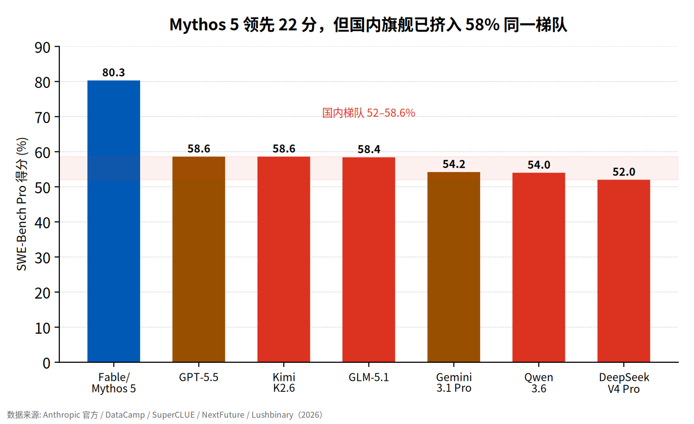
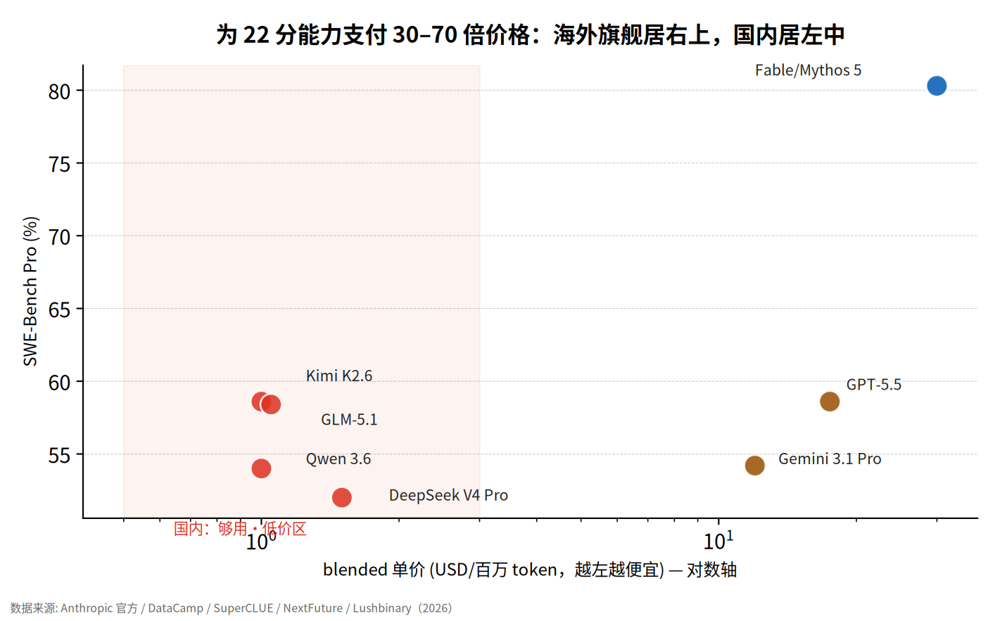
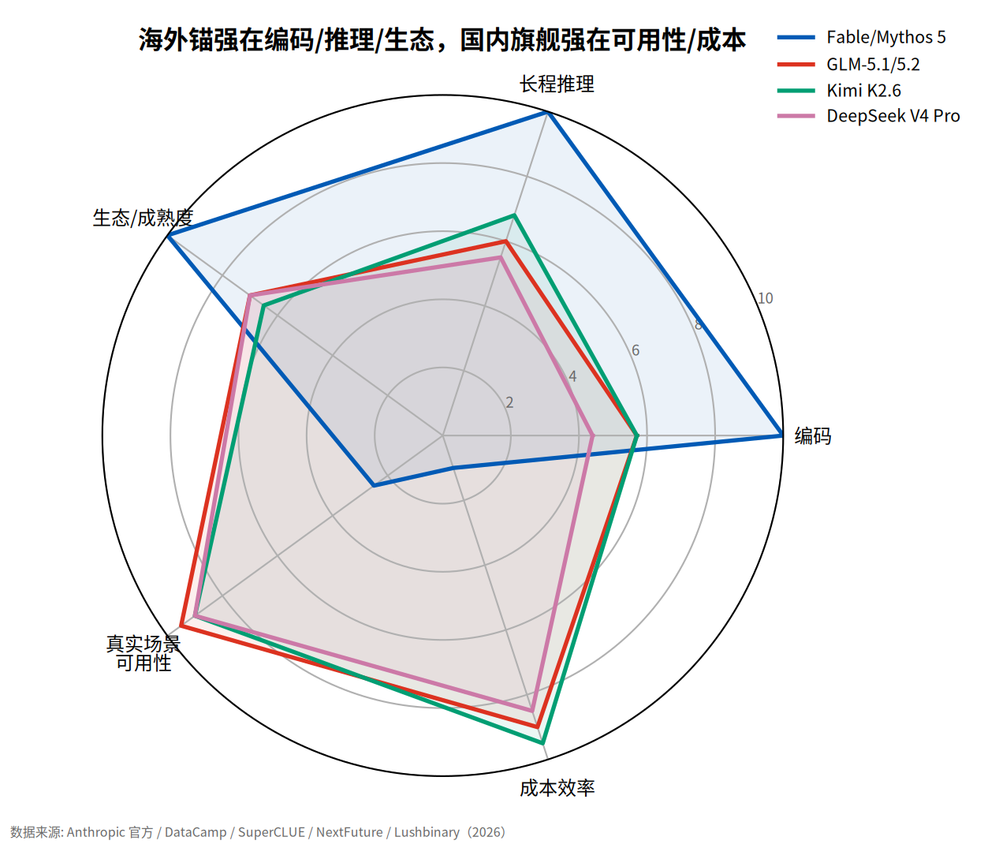
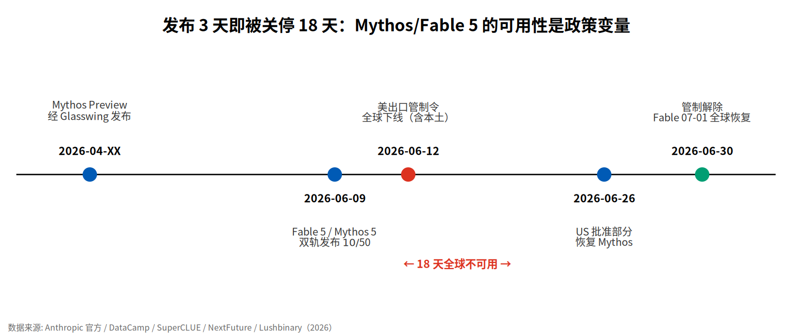
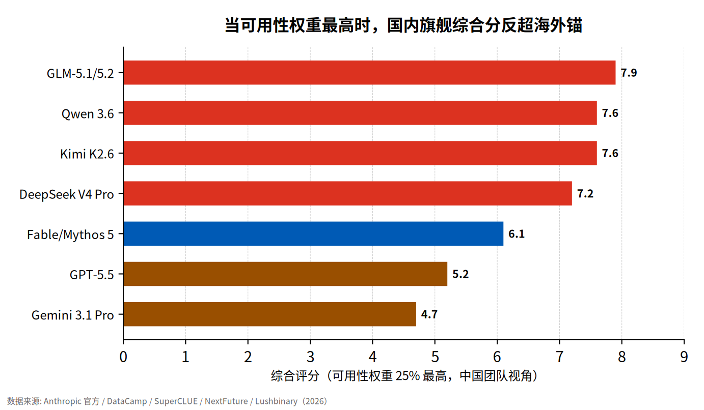

# 全球最强模型上线 3 天被政府关停：Mythos 5 给中国团队的不是 API，是一面镜子

> 2026 年 6 月，Anthropic 发布号称"全球最强"的 Claude Mythos 5 与其公开版 Fable 5。3 天后，两款模型被美国政府一纸出口管制令全球下线，18 天后才恢复——期间连美国本土用户都用不了。对中国团队，这不是一个能下单的更强 API，而是一个必须读懂的地缘样本。

**本报告的核心判断：对中国团队，真正该对标的是 Fable 5 的公开能力与"双轨发布"制度，而不是那个进不去的满血 Mythos 5。** 纸面能力差距真实存在（SWE-Bench Pro 80.3% vs 国内最高 58.6%），但价格差 30–70 倍、以及"最强模型可被 3 天关停"的可用性风险，共同决定了一件事：海外旗舰是标尺，不是地基。

---

## §1 模型介绍：同一个模型，两个名字，差别只在"谁能用"

**判断：Mythos 5 与 Fable 5 是同底座、同价、同能力的双胞胎，差异只在安全护栏是否抬起、以及谁被允许使用。** 它是能力分级发布的制度产物，不是比 Opus 更大的新一代模型。

Anthropic 在官方文档中写得很直白：两者共享同一底层模型，名称差异反映的是"护栏差异，而非能力差异"（Anthropic, 2026-06）。Fable 5 面向所有人，内置分类器会把敏感的网络安全与生物类请求降级路由到 Claude Opus 4.8；Mythos 5 则为通过审核的 Project Glasswing 伙伴抬起了这部分护栏。两者 API 定价完全相同：**输入 $10、输出 $50 每百万 token（Anthropic, 2026-06）**，相比 Mythos Preview 的 $25/$125 降了约 60%。这意味着"贵=更强"的直觉在这里失效——你多付的钱不会买到更强的 Mythos，因为 Fable 已经是同一个模型。

**能力上，它确实是当前公开可查的最强档。** 在 Anthropic 公布的对比中，Mythos 5 的 SWE-Bench Pro 得分 **80.3%，领先 Opus 4.8 的 69.2% 达 11 个百分点（Anthropic, 2026-06）**；ExploitBench（漏洞复现率）**78.0%，是 Opus 4.8（40.0%）的近两倍**，也是全表最大单项差距。这个 38 分的网络安全鸿沟，正是 Fable 5 要给这部分能力上锁的原因。需要指出，这些基准均为**厂商自报、缺少独立第三方复现**，本报告统一按 B 级证据处理（research_data.md §1.3）。

**安全评估不是附件，而是产品定义本身。** Mythos 级流量被强制留存 30 天用于安全监控（不用于训练），敏感数据部署前必须评估这一条款（Anthropic, 2026-06）。护栏、降级、留存、受控发布——这四件事共同定义了"谁能用 Mythos、什么任务会被砍"，它们不是公关辞令，而是决定采购可行性的硬约束。

---

## §2 横向对比·能力：差距真实，但价格差 30–70 倍是另一半事实

**判断：公开能力账要拿 Fable 5（可全球调用）对国内旗舰；纸面差距真实，但被价格与可获取性大幅对冲。** 把进不去的"满血 Mythos"塞进总分表，会制造无法复现的对比泡沫，所以本报告把 Fable/Mythos 合并为一个"海外锚"行。

数据显示，国内旗舰在编码基准上已进入同一梯队，但尚未追平顶格。**Kimi K2.6 与 GLM-5.1 的 SWE-Bench Pro 分别为 58.6% 和 58.4%（NextFuture / Lushbinary, 2026），与 GPT-5.5 的 58.6% 持平**，但距 Fable/Mythos 的 80.3% 仍有约 22 分。这个差距不该被粉饰。但关键不在这 22 分，而在为它付的价：**Fable 5 的 blended 单价约为 DeepSeek V4 Flash（$0.14/$0.28）的 30–70 倍（多源价目表, 2026）**。这意味着，除非任务本身位于国内模型能力的天花板之外，否则为那 22 分支付 30–70 倍溢价在多数业务场景中并不成立。

**与该发现形成对照的是中文场景的反超。** 在第三方中文软件工程评测 SuperCLUE 终端编程榜上，**智谱 GLM-5.2(max) 以 64.13 分全场最高、"编程能力断层领先"（SuperCLUE / 快科技, 2026-07-06）**，Kimi-K2.7-Code 55.43 分、小米 MiMo-V2.5-Pro 以单题 0.22 元成为最省钱选项。这说明：英文 Agent 基准的领先，不能直接推断为中文工程场景的领先——二者口径不可比（research_data.md §5），谁在你的实际语料上更好，要用你自己的任务集测。

**表1  七款模型五维评分矩阵（中国团队视角）**

| 模型 | 编码 | 推理 | 生态 | 可用性 | 成本 | 综合 |
|------|:--:|:--:|:--:|:--:|:--:|:--:|
| Fable/Mythos 5 | 10.0 | 10.0 | 10.0 | 2.5 | 1.0 | 6.1 |
| GPT-5.5 | 5.7 | 6.3 | 9.5 | 3.5 | 2.0 | 5.2 |
| Gemini 3.1 Pro | 4.8 | 6.0 | 8.5 | 3.0 | 2.5 | 4.7 |
| DeepSeek V4 Pro | 4.4 | — | 7.0 | 9.0 | 8.5 | 7.2 |
| Kimi K2.6 | 5.7 | 6.8 | 6.5 | 9.0 | 9.5 | 7.6 |
| GLM-5.1/5.2 | 5.7 | — | 7.0 | 9.5 | 9.0 | 7.9 |
| Qwen 3.6 | 4.8 | — | 7.5 | 9.0 | 9.0 | 7.6 |

---

## §3 横向对比·场景与风险：最大的坑不是跑分，是"开关不在你手里"

**判断：场景上国内赢在可自托管、合规与价格，海外赢在长程自主与最高难度工程；但对中国团队，最大的不是能力风险，是可用性与主权风险。**

先看能被证据支撑的场景分工。软件工程与科研自主上，Mythos 5 展示了国内尚无公开对标的长程能力：Stripe 称用它一天完成了 5000 万行 Ruby 代码库的迁移，其内部团队称蛋白质设计流程被加速约 10 倍（Anthropic 转述, 2026）——但这些都是**厂商转述、无独立复核的单例（B 级）**。而在可部署性上，国内旗舰的优势是结构性的：**GLM-5.1、Kimi K2.6 以 MIT/Apache 协议开源、可自托管，DeepSeek V4 与 Qwen 3.6-Plus 默认提供 1M 上下文，且可 OpenAI 兼容 API 直接接入（多源, 2026）**。

**但真正该写进风险第一行的，是可用性。** 业内普遍认为"出口管制已于 6/30 解除、Fable 已全球恢复，关停是旧闻"。这一共识有事实支撑：Fable 5 确实已于 2026-07-01 全球恢复（VentureBeat, 2026-07-01）。但以下数据不支持"风险已消除"这一推论：**这两款模型自 2026-06-12 起被出口管制令下线整整 18 天，期间连美国本土用户都无法使用（Anthropic 官方 / GadgetsNow, 2026）**；管制诱因是 Amazon 研究者发现可绕过 Fable 5 护栏、生成漏洞利用代码（Forbes, 2026）；而恢复后 **Mythos 5 仍仅限 Glasswing 受控伙伴，对中国从未开放**。这两个事实与"风险已消除"的方向不一致——能在发布 3 天后关停、能锁定特定国籍用户的模型，其可用性风险是结构性的，而非一次性的。

因此，更准确的判断是：**对中国团队，Fable/Mythos 的开关握在美国政府手里，不能作为主链路依赖。** 此外有一条需明确标注为**存疑**的线索：有中文媒体报道称 Claude Code 疑似用隐写术回传中国用户标记（观察者网, 2026-07-02）——该报道**仅单一来源、技术细节未经独立复现**，本报告仅将其作为方向性提醒，不作为核心判断的依据（research_data.md §4）。

**边界在哪里？** 在"你是美国境内、通过 Glasswing 审核的网络防御或关键基础设施伙伴"这个条件下，共识（Mythos 5 是最优选）成立——你能拿到满血、护栏抬起、且不受可用性困扰。但在"你是中国团队"这个条件下，刺点更接近事实——你既拿不到满血，又要承担被随时关停的风险。当前多数中国读者最接近后一个条件，因此本报告的判断偏向刺点。

---

## §4 战略启示：把 Fable 当标尺，别当地基

**判断：学双轨、对标 Fable、业务用国内、把海外旗舰当"能力标尺 + 应急备份"，而非主依赖。** 以下按角色给出可执行动作。

**表2  分角色决策表**

| 角色 | 推荐选型 | 理由 | 否决条件 |
|------|----------|------|----------|
| 模型厂商 | 补长程 Agent + 双轨制度 | 差距在 FrontierCode 长程工程 | 只追单次跑分 |
| 应用企业 | 国内旗舰为主链路 | 中文+合规+价格差 30–70 倍 | 把 Fable 设为唯一依赖 |
| 安全合规 | 断供演练 + 数据不出境 | 18 天停服 + 30 天留存 | 涉密数据流向 Mythos 级 |
| 投资研究 | 看长程+生态+可用性组合 | 单一跑分会误判座次 | 以某一基准绝对分排名 |

**如果你是模型厂商：** 补的不是单次跑分，是长程自主 Agent 与"双轨发布"制度。Mythos 5 拉开差距的是 FrontierCode Diamond（29.3% vs Opus 13.4%）这类**长程、高质量工程**能力，以及"大众版 + 受控双用途版"的发布范式（research_data.md §1.3）。国内在 58% 的编码梯队已站稳，下一战场是把 Agent 从"能补代码"推到"能自主交付整库"。

**如果你是应用企业（CTO/采购）：** 主链路押国内旗舰，按场景路由——中文工程与合规部署选 GLM-5.1/5.2 或 Kimi K2.6，成本敏感高并发选 DeepSeek V4 Flash，长上下文 repo 级理解选 Qwen 3.6-Plus。把 Fable 5 仅用于"国内模型确实够不着的天花板任务"，并且**永远准备一条国内备份链路**——因为它随时可能对你关闭。

**如果你是安全与合规：** 把"断供演练"写进预案。假设 Fable/GPT/Gemini 明天全部不可用，你的核心业务能否在国内模型上继续跑？30 天数据留存与疑似追踪意味着：**敏感、涉密、涉政务的数据不应流向 Mythos 级模型**。

**如果你是投资与研究：** 别用单一跑分排座次。真正的护城河指标是"长程自主完成率 + 生态可迁移性 + 可用性韧性"三者的组合，而非某个基准的绝对分。

---

## 局限性

需要指出，本报告的分析至少在以下方面存在局限：其一，Mythos 5/Fable 5 的能力基准均为**厂商自报**，缺少独立第三方复现，实际表现可能与官方数字有出入；其二，国内模型多缺 HLE、ExploitBench 等**同口径**海外基准分，跨基准对比只能做半对齐，这更可能**低估**而非高估国内能力；其三，价格数据在不同价目表间口径不一（DeepSeek V4 Pro 单价在来源间相差逾 2 倍），已降级并取区间；其四，"疑似对华追踪"仅单一媒体来源、未经独立验证，不构成本报告任何核心判断的依据。在"出口管制不再重演、且 Mythos 对华开放"这一特定条件下，本报告的核心判断可能不成立。

## 尾门

把 Fable 当标尺，别当地基——它的开关不在你手里。

---

## 参考来源

1. Anthropic 官网 / Platform Docs，《Introducing Claude Fable 5 and Claude Mythos 5》，2026-06。
2. Anthropic，《Redeploying Claude Fable 5》，2026-06-30。
3. DataCamp，《Claude Mythos 5: Features, Benchmarks & Capabilities》，2026-06-09。
4. VentureBeat，《Anthropic is bringing back Claude Fable 5 globally...》，2026-07-01。
5. Forbes，《Anthropic Disabled Fable 5 And Mythos 5 After A U.S. Export-Control Order》，2026-06-16。
6. GadgetsNow，《18 Days Offline, 99 Per Cent Blocked...》，2026-07。
7. SuperCLUE / 快科技，《国产编程大模型横评》，2026-07-06。
8. NextFuture，《2026 Chinese LLM Stack: Qwen vs DeepSeek vs Kimi vs GLM》，2026。
9. Lushbinary，《Best Open-Source LLMs for AI Agents May 2026》，2026-05。
10. 观察者网，《特朗普解禁两款 Claude 模型》，2026-07-02（**单一来源，存疑**）。

---

## 待跟进问题（团队可在此评论）

- [ ] 用我方真实任务集复测 Fable 5 vs GLM-5.2 / Kimi K2.6 的中文工程表现
- [ ] 核实 DeepSeek V4 Pro 官方最新定价（多源口径相差逾 2 倍）
- [ ] 出口管制是否会再次触发？评估对现有链路的断供风险
- [ ] 明确哪些敏感/涉密数据禁止流向 Mythos 级模型（30 天留存条款）
- [ ] 持续跟踪 Mythos 5 Trusted Access 是否对更多地区/行业开放
